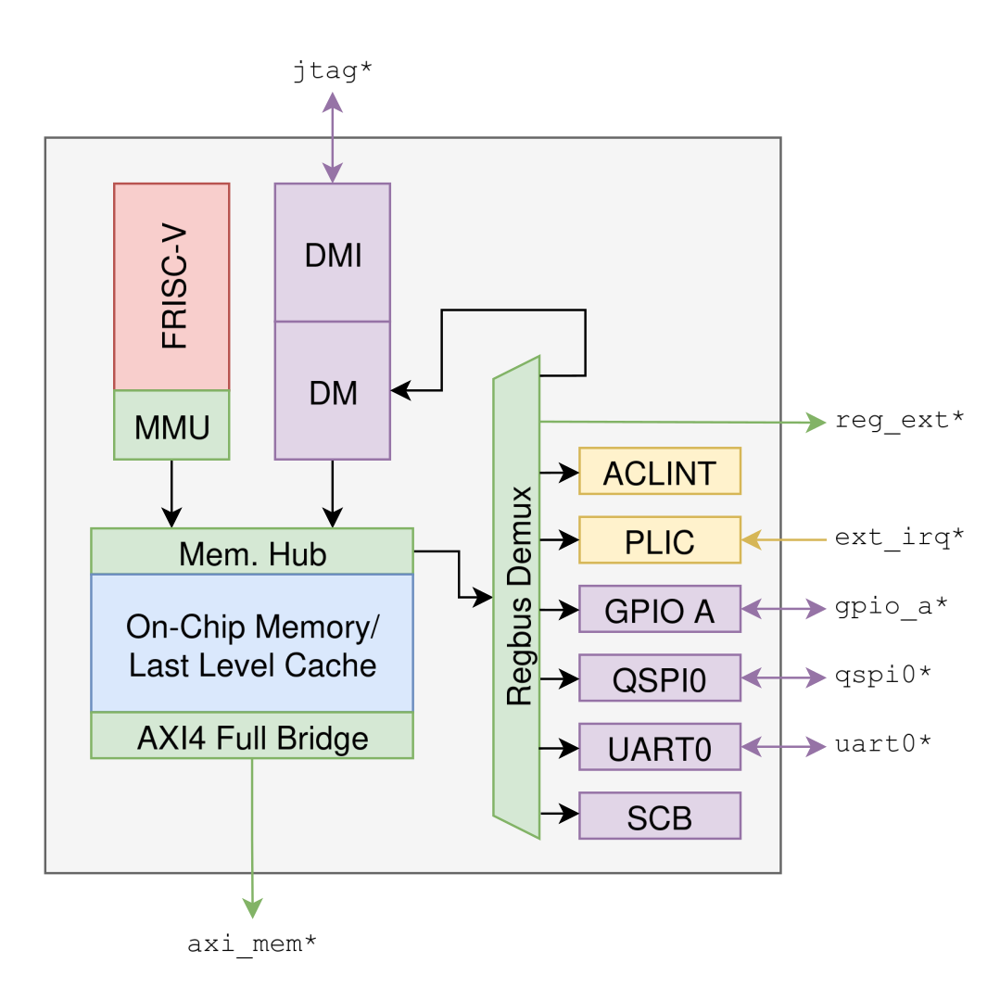

<!-- markdownlint-disable MD041 -->
[Home](DOCS_HOME.md) / [User Manual](USER_MANUAL.md)
<!-- markdownlint-enable MD041 -->

# Architecture

<!-- markdownlint-disable MD033 -->
<picture>
    <source media="(prefers-color-scheme: dark)" srcset="./figures/arch-diagram-dark-transparent.svg">
    
</picture>
<!-- markdownlint-enable MD033 -->

Vernii is configurable, but contains a fixed set of peripherals. The block diagram above depicts a Vernii SoC, which currently provides:

- **Core:**

  - Linux-capable FRISC-V core
  - A RISC-V debug module with JTAG transport

- **Peripherals:**

  - Standard I/O interfaces (UART, QSPI, GPIO)
  - Integrator-configurable boot ROM (default support for JTAG and QSPI boot)
  - General-purpose register bus port exposed to the outside

- **Interconnect:**

  - A last level cache (LLC) configurable as an on-chip memory (OCM) per-way
  - External AXI4 bus with a cached and uncached region

- **Interrupts**

  - Core-local (ACLINT) and platform (PLIC) interrupt controllers
  - GPIO and dedicated external interrupts
  - UART and QSPI interrupts

## Memory Map

Vernii's internal memory map is static.

TODO: table

The flags are defined as follows:

- **C**acheable: Accessed data may be cached in the LLC.
- **E**xecutable: Data in this region may be executed.

Additionally, Vernii assumes the following parametrized layout for external resources:

| Block | Start | End | Flags |
| ----- | ----- | --- | ----- |
|       |       |     |       |

## Components and Parameters

## FRISC-V Core

## Interrupts

## Debug Module

## Last Level Cache

## QSPI, GPIO

## UART

## Boot ROM

## Not Implemented

- **QSPI input synchronization** - They go straight into `spi_host`, as OpenTitan requires. Must constrain with respect to SCK instead.
- **AXI atomics** - Atomic instructions (`lr`, `sc`, `amo`) are atomic only from the view of the core (i.e. during interrupts), and not to other devices in the system.
- **DFT** - No scan implemented.
- **Zero initialization** - Non-`x0` GPRs and OCM initialize to `X`. Write before reading.
