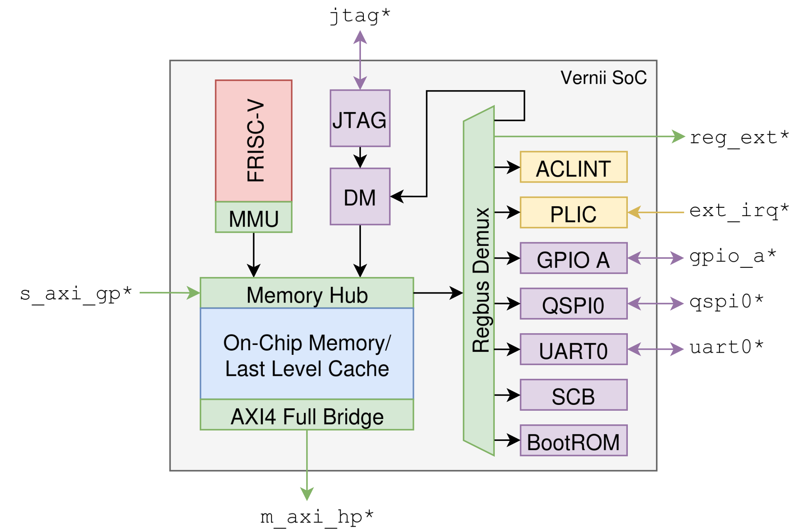

<!-- markdownlint-disable MD041 -->
[Home](DOCS_HOME.md) / [User Manual](USER_MANUAL.md)
<!-- markdownlint-enable MD041 -->

# Architecture

<!-- markdownlint-disable MD033 -->
<picture>
    <source media="(prefers-color-scheme: dark)" srcset="./figures/block-diagram-transparent-dark.svg">
    
</picture>
<!-- markdownlint-enable MD033 -->

Vernii is configurable, but contains a fixed set of peripherals. The block diagram above depicts a Vernii SoC, which currently provides:

- **Core:**

  - Linux-capable FRISC-V core
  - A RISC-V debug module with JTAG transport

- **Peripherals:**

  - Standard I/O interfaces (UART, QSPI, GPIO)
  - Integrator-configurable boot ROM (default support for JTAG, QSPI and UART boot)
  - General-purpose register bus port exposed to the outside

- **Interconnect:**

  - A last level cache (LLC) configurable as an on-chip memory (OCM) per-way
  - External AXI4 bus with a cached and uncached region

- **Interrupts**

  - Core-local (ACLINT) and platform (PLIC) interrupt controllers
  - GPIO and dedicated external interrupts
  - UART and QSPI interrupts

## Memory Map

Vernii's internal memory map is static.

| Block | Start | End | Flags |
| ----- | ----- | --- | ----- |
| OCM | `0x0000_0000` | `OcmSize` | E |
| ACLINT | `0x0200_0000` | `0x0202_0000` | |
| SCB | `0x0300_0000` | `0x0300_1000` | |
| UART0 | `0x0301_0000` | `0x0301_1000` | |
| QSPI0 | `0x0302_0000` | `0x0302_1000` | |
| GPIO port A | `0x0303_0000` | `0x0303_1000` | |
| ZSBL ROM | `0x0304_0000` | `0x0304_1000` | E |
| Debug module | `0x0305_0000` | `0x0305_1000` | E |
| PLIC | `0x0C00_0000` | `0x0C20_2000` | |

`0x0300_0000` to `0x03FF_FFFF` is reserved for Vernii, including the slots it
does not use yet. `MRegRules` may not map into it, and elaboration fails if one
does. Integrator peripherals start at `0x0400_0000`.

The flags are defined as follows:

- **C**acheable: Accessed data may be cached in the LLC.
- **E**xecutable: Data in this region may be executed.

Additionally, Vernii assumes the following parametrized layout for external resources:

| Block | Start | End | Flags |
| ----- | ----- | --- | ----- |
| External memory | `ExtBase` | `ExtBase + ExtSize` | E |
| Cached window | `CachedBase` | `CachedBase + CachedSize` | C, E |

## Components and Parameters

## FRISC-V Core

## Interrupts

## Debug Module

## Last Level Cache

## QSPI, GPIO

## UART

## Boot ROM

The reset vector, and a fixed 4 KiB slot whatever the ROM contains, so the
memory map does not move when the image does. An image may be at most 1024
words, and a read past its end returns a bus error.

The ROM itself is an integrator's to replace, through `ZsblRomWords` and
`ZsblRomProg`. What the default one does, and the layouts it expects on flash
and on a card, are in [SOFTWARE_STACK.md](SOFTWARE_STACK.md).

## Not Implemented

- **QSPI input synchronization** - They go straight into `spi_host`, as OpenTitan requires. Must constrain with respect to SCK instead.
- **AXI atomics** - Atomic instructions (`lr`, `sc`, `amo`) are atomic only from the view of the core (i.e. during interrupts), and not to other devices in the system.
- **DFT** - No scan implemented.
- **Zero initialization** - Non-`x0` GPRs and OCM initialize to `X`. Write before reading.
